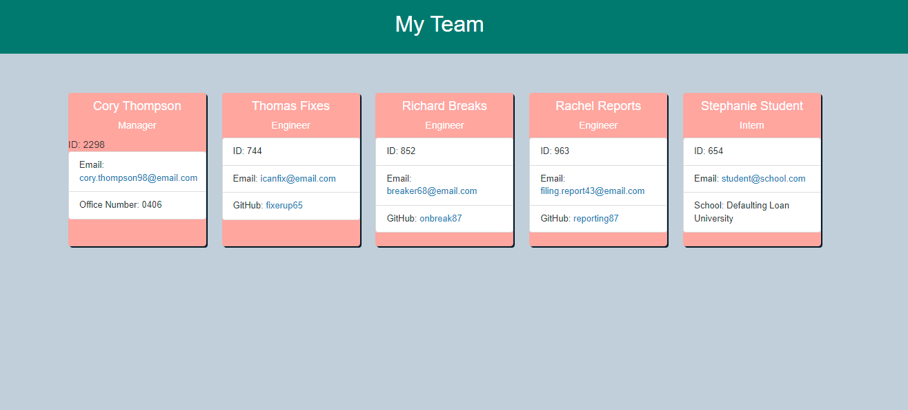

# team-profile-generator

## User Story
AS A manager
I WANT to generate a webpage that displays my team's basic info
SO THAT I have quick access to their emails and GitHub profiles

## Technologies
* HTML
* CSS
* Javascript
* Jest
* Node
* Inquirer

## How to Use
* Clone the repo
* run "npm install" to install Node, Jest, and Inquirer
* Invoke the program using index.js

## License

## Author

Cory Thompson
